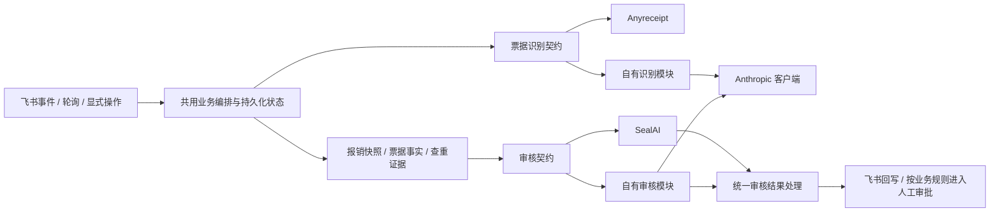

# 架构评审：外部能力主线与自有能力替换

日期：2026-10-03；代码基线：`7624896`。依据当前代码、README、上级需求背景及仓库内接口备份进行静态评审，未重新验证线上接口。

后续已开始落地，当前实现见 [运行与交接说明](runtime-and-handoff.md)。本评审保留实施前快照；本地规则集仅适用于自有审核，Seal 主线的规则在 SealAI 维护。

**用户已明确的方向**：主线使用 Anyreceipt 与 SealAI 两套外部能力；副线通过配置选择自有 Anthropic 模块，在内部实现对应业务能力。飞书是业务入口、数据及人工审批载体，不是这里要替换的两套 AI 能力之一。

**本文的目录、契约及迁移步骤是设计建议，尚未实施。** 本次只落评审与交接文件；重大结构和业务调整仍须先对齐方案。后续执行见 [迁移任务与验收](architecture-tasks.md)。

## 1. 总体判断

现有代码已经验证了两段有价值的链路：附件识别回写、聚合票据提交 Seal。值得保留的是外部客户端、飞书应用身份、字段 ID 映射、识别器接口和不直接审批的查重证据模块。

主要缺口是**缺少由本项目掌握的完整业务编排层和审核能力契约**。目录以供应商命名，却收纳了共用流程；识别接口虽然可替换，数据格式仍由 Anyreceipt 定义；审核还没有可替换接口。继续沿现状扩展，会让自有模块被迫模拟供应商格式，并重复建设送审、回写和恢复流程。

目标应该是一套业务流程、两个独立能力选择点：



编排层决定何时处理、处理哪个版本、如何重试及回写；提供方实现识别或审核。AI 审核结论、人工审批结果、报销结算状态应分别记录，不能合成一个 `approved`。

## 2. 发现的问题及影响

以下优先级是扩展顺序，不代表线上事故级别。P0 表示对应能力投产前必须明确。

| 优先级 | 代码证据 | 全局影响与建议 |
| --- | --- | --- |
| P1 | `anyreceipt/flow` 同时服务 Anyreceipt 和模型，解析飞书事件；`anyreceipt/ledger` 写飞书台账 | 共用用例归属供应商。抽出业务编排；飞书事件解码和表字段映射留在飞书适配层。只改目录名仍不能解决依赖。 |
| P1 | `seal/review/review.go` 的 `SealGateway` 使用 `seal.Attachment`、`seal.DocumentRequest`，`Result` 暴露 `seal.SubmitResponse`；`feishu/base/review.go` 导入 `seal/review` | 这是 Seal 协议抽象，并非可替换的审核能力。先定义中立输入输出，把上传和 Seal 映射收回 Seal 实现，飞书读取器返回中立结构。 |
| P1 | `core/invoice/recognition.go` 的 `Outputs`；台账、Seal mapper 读取 `DateofInssuance` 等键；模型 prompt 也要求这些键 | 包名中立但数据语义不独立。由各提供方归一化，公共流程只消费明确的业务字段；原始 JSON 作为证据保留。 |
| P0 | `aggregate.Document` 主要包含来源标识、时间、票据和查重候选；`ReviewSource` 不读取交易事实、申报金额、申请人与项目等上下文 | 当前是票据送审链路，不是完整费用审核。缺少这些依据时，金额比对、身份核对、历史占用等规则无法可靠执行；自有模型也不能补造事实。 |
| P0 | `ReviewSource.ReadDetail` 以 Base/Table/Record 构造固定 `DocumentID`；README 已记录同 ID 重提未更新审核记录的测试现象 | 追加附件或修改金额后复用旧 ID，可能仍得到旧版本结论。需定义报销版本、提交尝试及外部编号映射，旧回调不得覆盖当前版本。不能假定 Seal 支持原地更新。 |
| P0 | `flow.Run` 的 `seen`、`Poll` 的 `baseline` 都在内存；`core/dedupe.Claimer` 只有 `Claim`；回调只有 mock | 重启补偿、失败释放、提交超时结果不明、重复回调尚无完整语义。飞书台账已有稳定创建 token，但它不能代替跨系统任务状态与恢复。 |
| P1 | 一个 `Recognize` 返回一个 `Recognition`，来源键为记录 ID + 文件 token；`UniqueKey` 使用 `traceId` 或来源哈希 | 文件、识别尝试、真实发票被近似当作同一对象。一个 PDF 多张票、跨文件同票、切换模型重新识别都需要明确身份；供应商追踪号不能成为内部发票身份。 |
| P1 | `ReadLedgerEntry` 从原始 OCR JSON 构造识别结果，但查重事实读取台账列 | 人工修正台账后，查重可能使用新值，送审字段仍使用旧 OCR 值。需要同时保留原始值、修正值及其来源，规定有效事实和版本。 |
| P1 | 配置只有 `RECEIPT_PROVIDER`；`submit-seal` 固定 Seal；模型仅支持图片且只解析纯 JSON | “可配置替换”只完成了识别入口，且输入覆盖还不等价。需要独立审核选择、能力声明与替换验收。 |

另有文档漂移：AGENTS 的入口描述仍停留在基础 HTTP 与长连接，部分子目录 README 也早于当前实现。阅读顺序应是规则 → 当前 README → 代码；历史指南里的金额阈值和流程示例不能升级为业务契约。

## 3. 建议的最小职责调整

保持单体 Go 服务，不引入微服务、通用插件框架或全仓 `adapters/` 搬迁。只在真实需求到达时建立以下目录；不要先生成空接口和空包。

```text
internal/
  core/
    invoice/             标准票据事实、识别结果
    reimbursement/       报销身份、版本、快照（需要时新增）
    review/              审核输入输出、状态及规则证据（新增）
    dupcheck/            查重候选证据，保留
    dedupe/              既有领取边界，设计任务恢复时再评估
  app/
    recognition/         附件任务、调用识别、交付台账写入
    review/              读取快照、核验就绪、发起审核、应用结果
    approval/            分组建飞书审批、处理人工结果（后续）
  anyreceipt/            Anyreceipt 请求、解析与归一化
  seal/                  Seal 上传、提交、协议映射、回调适配
    mapper/              保留 Seal 专用映射
  anthropic/             独立 Messages 客户端，保留
    model/               既有自有识别实现，暂不为命名搬迁
    review/              自有审核实现（后续新增）
  feishu/
    base/                事件解码、附件读取、台账映射与读写
    approval/            飞书模板、实例及人工结果协议
  state/                 任务、提交和回调持久化实现（选型后新增）
  config/                配置解析与校验
```

依赖约束：

- `core` 不依赖 SDK、供应商、飞书或 `app`；现有纯函数聚合先保留，确需报销快照时再调整归属。
- `app` 持有用例所需的小接口，消费中立结构，不导入 Anyreceipt、Seal、Anthropic、飞书 SDK 类型。
- `anyreceipt`、`seal`、`anthropic` 独立实现能力。Anthropic 客户端不搬进 Seal 或票据域；自身两个业务模块共用客户端，不复制整条业务流水线。
- 飞书输入适配器可调用 `app`；飞书输出适配器实现用例接口。`app` 不反向导入飞书，避免环依赖。
- `cmd/server` 只装配所选实现和管理生命周期。已有命令与配置的兼容性单独处理。

## 4. 需要先稳定的契约

下面是设计语义，不是已经存在的 Go API，也不是外部接口定义。

### 4.1 票据识别

统一结果至少分为：标准票据事实、来源证据、执行元数据、数据质量问题。

- 标准事实包含票号、日期、买卖方、币种、金额等，不再依赖供应商拼写。金额使用精确十进制表示，缺失与零分开；币种、税额不从无关字段猜测。
- 来源证据包含附件引用、页码/区域（能力支持时）、原始响应。原始内容不承担公共数据库 schema 的职责。
- 执行元数据记录提供方、模型/解析版本、识别时间及供应商追踪号。模型重跑是新尝试，不自动改写已经送审的事实。
- 明确一附件是否支持多票。未实现时明确拒绝或标记待处理，不能默认为一张而静默丢票；支持后用票据子标识保持来源追溯。
- 台账人工修正应作为有来源的覆盖层，不能被重复 OCR 无条件覆盖；有效事实改变后，受影响的报销快照产生新版本。

旧台账可能只有供应商 JSON。需要有版本的兼容读取器，保留历史 `source_key`、`traceId` 和关联关系；不能在一次重构中直接换键或批量覆盖历史记录。

### 4.2 审核

审核输入是冻结的报销快照：报销及版本标识、申报事实、关联交易事实、有效票据事实、原件引用、历史查重/占用证据、规则集版本，以及明确的缺失项。

审核接口在业务上表达“请求审核”，支持返回已受理的任务引用，或已完成的结果。Seal 的异步回调和自有模型的同步返回最终都进入同一个结果处理用例。**附件上传是 Seal 的实现细节，不要求自有模块先生成 Seal 附件 ID。**

统一结果保留 `approve / reject / review` 的业务语义、说明、提供方引用和可选规则证据。处理失败、超时、结果未知独立表示，不能混入审批结论。仓库备份明确 Seal 当前不返回 `rulesResult`，因此完整规则明细不能作为统一结果的强制字段，也不能从评论文本假造。

自有审核不是增加一个 prompt：确定性金额运算、授权事实、历史占用查询由业务代码与受验证的数据源提供；模型做适合语义判断的部分。规则缺数据时输出明确的无法判断/需复核结果，具体路由须由确认后的业务规则决定。

### 4.3 配置替换与能力等价

保留已有 `RECEIPT_PROVIDER=anyreceipt|model`，建议新增独立的 `REVIEW_PROVIDER=seal|model`。后者目前不存在；也不意味着设置后可以立即自动送审。

| 识别 | 审核 | 用途 |
| --- | --- | --- |
| Anyreceipt | Seal | 当前主线的目标闭环 |
| 自有模块 | Seal | 独立验证识别替代 |
| Anyreceipt | 自有模块 | 独立验证审核替代 |
| 自有模块 | 自有模块 | 完整自有能力路径 |

未启用的能力不要求其密钥；选择被 `no_anthropic` 排除的能力要在启动时明确报错。运行中任务固定使用创建时的提供方、模型及规则版本，修改配置不重路由已有任务。

首版用显式选择，不做静默失败切换。以后需要降级，应定义新的尝试及审计记录。识别替代要验证 PDF/多页、字段准确性与失败处理；审核替代要验证规则覆盖、证据、人工交接及可追溯性。“调用模型成功”不等于替代成功。也不要求复制供应商 UI，但必须明确供应商审核详情页、人工结果同步等能力由谁承接。

## 5. 业务生命周期必须由项目掌握

先区分三个单位：单附件识别任务、一条报销明细的版本化审核、由多条明细分组生成的飞书人工审批。不能让一个供应商 `documentId` 同时充当三者身份。

| 对象 | 至少要回答的问题 |
| --- | --- |
| 附件识别任务 | 来源范围、附件及内容版本、提供方版本、处理状态、重试、原始结果与台账交付是否完成 |
| 报销版本 | 哪些申报/交易/附件/修正事实组成快照，何时冻结，什么变化使旧结果失效 |
| 审核尝试 | 本地尝试 ID、所用规则和提供方、外部请求/任务 ID、提交是否确定受理 |
| 回调与结果 | 如何鉴权和关联、重复与乱序如何处理、结果已保存但飞书回写失败如何恢复 |
| 人工审批组 | 包含哪些明细版本、所属租户和实例 ID、人工结果如何回写、撤销/退回后如何重新发起 |

需要持久化任务状态、提交映射和回调收件记录；具体数据库不在此次评审中预选。单个 `Claim(key) bool` 无法表达租约到期、重试、完成和结果未知。可从单实例持久化任务开始，不必马上引入独立消息队列。

外部调用与本地提交无法组成同一事务：请求超时后可能已受理，必须保留“结果未知”，按经验证的供应商幂等/查询能力恢复，不能直接换新 ID 重投。回调先可靠保存，再驱动幂等回写；供应商特定的鉴权仍需真实协议确认。

当前“所有现有附件都有 OCR”仅说明可组装数据，不代表员工已经填完报销。自动送审前必须明确提交/冻结信号；延时等待不能证明附件不会继续追加。即便暂时沿用显式命令，也要在快照生成、提交关联处处理并发修改。

附件删除、金额修正、重识别、规则更新的版本影响要显式定义。旧版本回调可归档，但不得覆盖新版本状态或已确认的人工结果。跨单据历史占用需要审批/撤销/结算等生命周期事实；`dupcheck` 的相似票据候选不能替代这些事实。

飞书个人 Base 与企业审批使用不同应用身份；跨租户人员标识需显式映射，不能假设同一个 `open_id` 通用。汇总建单规则、审批模板字段、可见性和锁定能力仍需核对，不能由此文或模型自行设定。

## 6. 优先顺序

先稳定共享边界与数据契约，再补齐版本和可靠性，以 Anyreceipt + Seal 跑通受控审核闭环；自有识别、自有审核分别对照同一契约验收。自动触发、飞书汇总审批按各自业务前置条件接入。

暂不投入：大规模目录重命名、通用工作流引擎、提前微服务化、用大接口覆盖所有供应商、把历史指南中的八条规则和阈值直接硬编码。衡量每项改动的标准是：**替换任一提供方，是否仍能复用同一份事实、同一套状态与回写逻辑。**
